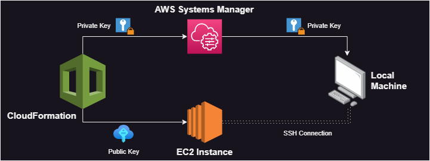
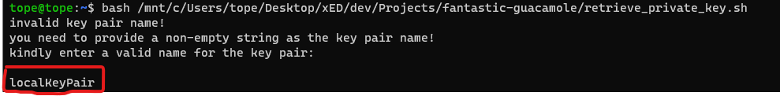
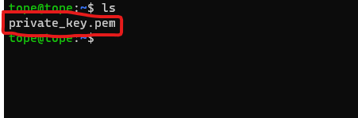
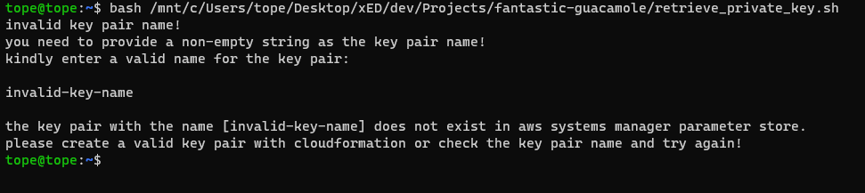

# fantastic-guacamole

This is a script to retrieve private ssh key from AWS Systems Manager parameter store and save it to a local machine.

# Architecture



## Backstory

When you create a key pair using the AWS Management Console, you are prompted to download and save your private key (.pem file) locally to ssh into the instance. However, this doesn't happen when you create a key pair with AWS CloudFormation. Hence, you need to get your private key using this bash script.

After creating your key pair with CloudFormation, CloudFormation securely stores the private key in AWS Systems Manager parameter store for you using the format `/ec2/keypair/<key_pair_id>`. Now, you need to retrieve this private key from the systems manager using either the management console or the cli (suggested).

## How to Run

Suppose you define your key pair using the YAML block below;

```yaml
Resources:
  NewKeyPair:
    Type: 'AWS::EC2::KeyPair'
    Properties: 
      KeyName: key-pair-name
```

1. Run the script
    ```bash
    bash <path-to-script>
    ```

2. Enter the name of the key pair

    

3. If all goes well, your private key file should be in your specified directory
   
    

## Edge Cases

1. If an empty string is provided as key file name, the program won't proceed until a valid string is provided

2. If an invalid key name is provided, the program will exit
   
    


---
Medium blog post - 